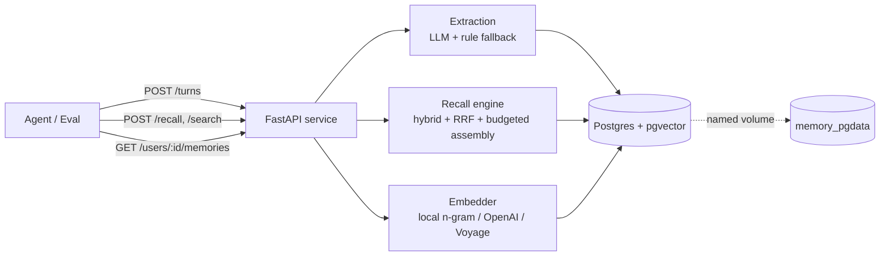

# memory-service

A Docker-deployable memory service for AI agents. It ingests conversation
turns, extracts **structured, typed knowledge** from them, tracks how facts
**evolve over time**, and answers **recall** queries that decide what context
the agent sees on its next turn.

```bash
git clone <repo> memory-service && cd memory-service
docker compose up -d
until curl -sf http://localhost:8080/health; do sleep 1; done
# eval now points at http://localhost:8080
```

No manual setup, no API key required to boot. Data survives
`docker compose down && docker compose up` via a named volume.

---

## 1. Architecture



```
                 ┌──────────────────────── memory-service (FastAPI) ───────────────────────┐
 POST /turns ───▶│ store turn ─▶ extract memories ─▶ supersede by (scope, key) ─▶ commit    │
 POST /recall ──▶│ intent ─▶ hybrid retrieve (vector ⊕ FTS, RRF) ─▶ priority-tiered assembly │
 POST /search ──▶│ hybrid retrieve over turns + memories ─▶ structured results              │
 GET  memories ─▶│ full supersession chain (active + superseded)                            │
                 └───────────────────────────────────┬─────────────────────────────────────┘
                                                      ▼
                              Postgres 16 + pgvector  (relational + vector + full-text)
                                                      ▼
                                          Docker named volume: memory_pgdata
```

A single FastAPI service in front of a single Postgres instance. The service is
a **monolith** — extraction, embedding, persistence, and recall are modules, not
microservices — because the contract demands *synchronous correctness* (after
`/turns` returns, the data must be readable) and one ACID store is the simplest
way to guarantee that. Endpoints are synchronous handlers run in FastAPI's
threadpool; that's more than enough for the "few concurrent sessions" the eval
exercises and avoids async footguns around blocking DB and CPU-bound embedding
calls.

Everything that matters for recall lives in two tables — `turns` (raw,
episodic) and `memories` (extracted, semantic) — each carrying a `vector`
column for similarity and a generated `tsvector` for full-text search.

---

## 2. Backing store — Postgres + pgvector

**One store does three jobs:**

| Job | Mechanism |
| --- | --- |
| Relational facts, supersession chains, provenance | ordinary columns + indexes |
| Vector similarity | `pgvector` `vector(N)` + `<=>` cosine, HNSW index |
| Keyword / lexical search | generated `tsvector` + GIN, `ts_rank_cd` |

**Why this over the alternatives:**

* **ACID = synchronous correctness for free.** The contract forbids eventual
  consistency. With Postgres, `/turns` writes the turn and its extracted
  memories in committed transactions before returning; every read path sees
  them immediately. A vector DB + separate metadata store would force me to
  reason about cross-store consistency.
* **Hybrid retrieval in one query engine.** Recall needs both semantic and
  keyword matching (see §4). Postgres gives me cosine *and* BM25-style ranking
  natively — no second system, no sync.
* **Supersession is a relational problem.** Fact evolution is "find the active
  row for `(user, key)`, deactivate it, link the new one." That's a couple of
  indexed statements in a transaction — exactly what a relational store is for.
* **It's boring and durable.** One named volume, one well-understood failure
  model, trivial to inspect with `psql` during a review.

The vector dimension is fixed at deploy time (`EMBED_DIM`, default 384) so the
schema is stable.

---

## 3. Extraction pipeline — turning turns into knowledge

> A message log stores text. A memory service stores *knowledge*. Extraction is
> the difference, and `/users/{id}/memories` returns typed records, never raw
> chunks.

Each turn is run through an extractor that emits `ExtractedMemory` records with
a **type**, a **canonical key**, a **value**, an optional **subject**, a
**confidence**, and a **correction** flag. Two interchangeable backends produce
the same shape:

* **LLM (primary, when `ANTHROPIC_API_KEY` is set):** Claude with **structured
  outputs** (`output_config.format` + a JSON schema) so the response is always
  valid JSON. The prompt supplies a controlled key vocabulary and the user's
  *current known facts*, which lets the model reuse keys (so contradictions line
  up) and resolve implicit references. Default model `claude-opus-4-8`
  (configurable via `EXTRACTION_MODEL`; `claude-haiku-4-5-20251001` is a good
  lower-latency/cost option). Extraction runs inside `/turns`, which the eval
  gives a 60s budget — we spend it on quality, not async orchestration.
* **Rule-based (fallback, always available):** deterministic regex/heuristics
  for employment, location, pets, diet/allergies, family, name, preferences,
  opinions, and goals. Zero dependencies, zero network — so recall still works
  with no API key, and a transient LLM failure degrades instead of dropping the
  turn.

**What it extracts** (canonical keys): `identity.name`, `employment.company`,
`employment.role`, `location.city`, `location.origin`, `family.*`, `pet.name`,
`pet.type`, `diet`, `allergy`, `preference.*`, `opinion.<topic>`,
`event.<topic>`, … Two memories about the same attribute share a key so the
newer supersedes the older.

* **Implicit facts:** "walking Biscuit this morning" → `pet.name = Biscuit`.
* **Corrections:** "actually, I meant…" sets `correction` and supersedes.
* **Decomposition:** "moved to Berlin from NYC" → `location.city = Berlin`
  *and* `location.origin = NYC`.

**What it misses (honestly):** the *rule* backend is precision-biased and will
miss novel phrasings, sarcasm, coreference across turns, and abbreviations it
hasn't seen (it gives implicit guesses lower confidence so ranking can
discount them). These are exactly the cases the LLM backend handles — the rule
path is a floor, not the ceiling.

---

## 4. Recall strategy — end to end

`POST /recall` is the primary signal. Pipeline:

1. **(Multi-hop) user resolution.** If `user_id` is null, salient entities in
   the query ("…dog named *Biscuit*…") are matched against memory *values* to
   find the owning user. No match → no guess (preserves noise resistance).
2. **Hybrid retrieval.** Two channels run over active memories *and* over turns:
   * **Vector** — `pgvector` cosine over the embedding.
   * **Lexical** — Postgres full-text `ts_rank_cd` over a `tsvector` that
     includes the value **plus alias terms** for the key (e.g. `location.city`
     folds in "live lives home city where"), so paraphrased questions match
     topic-keyed facts.
   The two rank lists are fused with **Reciprocal Rank Fusion** (RRF, k=60).
   Hybrid beats vanilla cosine-top-k: keyword probes ("what's the dog's
   name?") lean on lexical; paraphrases lean on vectors; RRF needs no score
   calibration between them.
3. **Intent ordering.** A cheap regex intent classifier maps the query to key
   families ("where do they live" → `location.*`) and pushes matching facts to
   the front, so the relevant ones survive a tight budget.
4. **Priority-tiered assembly under `max_tokens`.**

### Priority logic when the budget is tight (defended)

Tiers are filled **in order**, stopping when the budget (95% of `max_tokens`,
estimated conservatively) is exhausted:

1. **Stable user facts** (`type=fact`, intent-ordered). Most identifying, most
   reusable, most compact — highest value per token. Always included if present.
2. **Preferences** (`type=preference`). Shape *how* the agent should respond;
   cheap and durable.
3. **Query-relevant episodic memories** (opinions, events) — **relevance-gated**.
4. **Relevant recent conversation** (turns, dated) — **relevance-gated**.

Rationale: stable facts are the context most likely to matter on *any* next
turn and rarely change, so they earn the first tokens. Preferences are next
because they steer tone/format regardless of topic. Tiers 3–4 are
query-specific and therefore gated on an actual retrieval match — which is also
what gives **noise resistance**: an off-topic query surfaces the user's real
facts (legitimate context) but *never* a fabricated "relevant" snippet, and a
cold user/session returns `{"context": "", "citations": []}`.

The returned `context` is readable prose for a frozen LLM:

```
## Known facts about this user
- Works at Notion (updated 2025-03-15; previously Stripe)
- Lives in Berlin (updated 2025-03-15; previously San Francisco)
- Has a dog named Biscuit
- Vegetarian
- Allergic to shellfish

## Preferences
- Prefers concise/direct answers

## Relevant from recent conversations
- [2025-03-10] user: debugging a React performance issue with excessive re-renders
```

`/search` shares the retrieval core but returns **structured** results
(content, score, session_id, timestamp, metadata) for an agent tool call,
rather than prose.

---

## 5. Fact evolution, contradictions, and corrections

Every memory has a canonical `key`. On write, for mutable types
(`fact`, `preference`, `opinion`):

* find the active memory for `(scope, key)`;
* same value → refresh timestamp/confidence (no churn);
* different value → mark the old row `active=false`, set `superseded_by`, and
  insert the new row with `supersedes` pointing back.

So `/recall` returns only the **current** fact, annotated with history
(`"Works at Notion (updated 2025-03-15; previously Stripe)"`), while
`/users/{id}/memories` exposes the **full chain** (active + superseded) for
inspection. `event`-type memories never supersede — they accumulate, because
"prepared for an interview in March" doesn't invalidate "prepared for one in
January."

**Opinion arcs** ("love TypeScript" → "generics are annoying" → "fine for big
projects, Python for scripts") are modeled as a supersession chain on
`opinion.<topic>`: the latest stance is active and recall surfaces it with an
`(evolved from: …)` note reconstructed from the chain. This is a deliberate
partial solution — it captures *current stance + immediate prior* rather than
the full nuanced trajectory; representing a gradual multi-point arc faithfully
(rather than a sequence of overwrites) is the main place I'd invest next.

---

## 6. Scoping (intentional cross-session sharing)

* **Memories with a `user_id` are user-scoped** and shared across that user's
  sessions — this is intentional and is what makes "told us in session 1,
  recalled in session 3" work (the smoke test relies on it).
* **Memories without a `user_id` are session-scoped** (`user_id IS NULL AND
  session_id = …`) and never bleed.
* **Recent-conversation recall** spans a user's sessions when a `user_id` is
  present, else stays within the session.
* Concurrent sessions for *different* users never share anything.

---

## 7. Tradeoffs — what I optimized for, what I gave up

* **Robustness & portability over peak semantic recall.** The default embedder
  is a dependency-free hashed n-gram vectorizer — no model download, no GPU, no
  key, tiny image, works on a locked-down network. It captures lexical and
  sub-lexical overlap but not deep synonymy. I compensate with structured
  topic-keyed facts, alias-enriched FTS, and intent mapping — and the recall
  layer treats the vector channel as *one* signal. Want true semantic vectors?
  Set `EMBED_PROVIDER=openai|voyage` (both pinned to `EMBED_DIM`). **This is a
  deploy-time choice**: mixing providers over one store yields incomparable
  vectors — reset the volume to switch.
* **Quality over latency in `/turns`.** Extraction (and an LLM call when
  configured) runs synchronously so memories are queryable the instant `/turns`
  returns. The eval's 60s write budget makes this the right call.
* **Monolith over services.** Simpler consistency and ops; I gave up
  independent scaling I don't need at this size.
* **Precision-biased rule fallback.** Fewer false memories at the cost of
  recall when no LLM is present.

---

## 8. Failure modes

| Situation | Behavior |
| --- | --- |
| **No data / cold session** | `/recall` returns `{"context":"","citations":[]}` with 200 — never an error. |
| **Missing `ANTHROPIC_API_KEY`** | Extraction falls back to rules automatically; everything else is unaffected. |
| **LLM call fails mid-turn** | Caught; falls back to rules; the turn is still stored. `/turns` never 500s on extraction. |
| **Embedding provider error** | Per-row fallback to local embedder; if even that fails the row is stored with a NULL vector and remains findable via FTS. |
| **Malformed input / bad JSON / missing fields** | Pydantic → 4xx, service stays up. Scalar/structured `content` is coerced to text. |
| **Oversized payload** | Bodies > 16 MB rejected with 413; per-turn content capped at 200k chars. |
| **Unicode / emoji oddities** | Stored as UTF-8; tsquery errors are caught and skipped. |
| **DB slow to start** | App retries the initial connection with backoff; `/health` returns 503 until ready, 200 after. |
| **Slow disk** | Writes block within the request (no eventual consistency); `/recall` latency is dominated by a handful of indexed queries. If retrieval ever became slow at scale, the HNSW + GIN indexes and a smaller candidate `LIMIT` are the first knobs. |
| **Restart mid-write** | Uncommitted work rolls back; committed turns/memories survive (named volume). |

---

## 9. Running the tests

The image bundles the tests. With the stack up:

```bash
docker compose up -d
docker compose exec app pytest -q            # contract + recall-quality + unit
```

* **Pure unit tests** (no service needed): `pytest tests/test_extraction_unit.py`
* **Recall-quality self-eval** (the iteration loop): ingests
  `fixtures/conversations.json`, runs `fixtures/probes.json`, prints
  "X of Y expected facts surfaced", and asserts a threshold. See it with
  `docker compose exec app pytest -s tests/test_recall_quality.py`.
* **Restart persistence** (drives docker from the host, opt-in):
  `RUN_DOCKER_TESTS=1 pytest tests/test_persistence.py`

Tests namespace all ids per run and clean up after themselves, so they're safe
to run against a live instance.

Point tests at a non-default host with `MEMORY_BASE_URL`. If `MEMORY_AUTH_TOKEN`
is set, the test client sends it automatically.

---

## 10. HTTP contract

| Method | Path | Purpose |
| --- | --- | --- |
| GET | `/health` | Readiness probe (200 ready / 503 starting). |
| POST | `/turns` | Persist a turn, extract memories, return `{id}` (201). |
| POST | `/recall` | Formatted, budgeted context + citations (200). |
| POST | `/search` | Structured search results (200). |
| GET | `/users/{user_id}/memories` | Full memory store incl. supersession chain. |
| DELETE | `/sessions/{session_id}` | Delete a session's data (204). |
| DELETE | `/users/{user_id}` | Delete a user's data (204). |

Auth is an optional `Authorization: Bearer <token>` — enforced only if
`MEMORY_AUTH_TOKEN` is set (and never on `/health`).

## 11. Configuration

All optional; see `.env.example`. Key vars: `MEMORY_AUTH_TOKEN`,
`ANTHROPIC_API_KEY`, `EXTRACTION_MODEL`, `EXTRACTION_BACKEND` (auto|llm|rules),
`EMBED_PROVIDER` (local|openai|voyage), `EMBED_DIM`, `DATABASE_URL`.

## 12. Repository layout

```
README.md  CHANGELOG.md  docker-compose.yml  Dockerfile  .env.example
src/memory_service/   config db embeddings extraction memory_store recall models main tokens
tests/                contract · recall_quality · extraction_unit · persistence
fixtures/             conversations.json · probes.json
```
